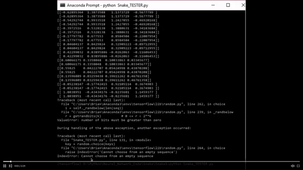

# Snake_DNN
Created the famous game Snake in python as a functional programming piece. Added a Neural network which takes data from the game and learns to play the game through analysing the game data. Created 2018.

